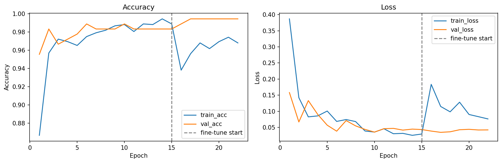
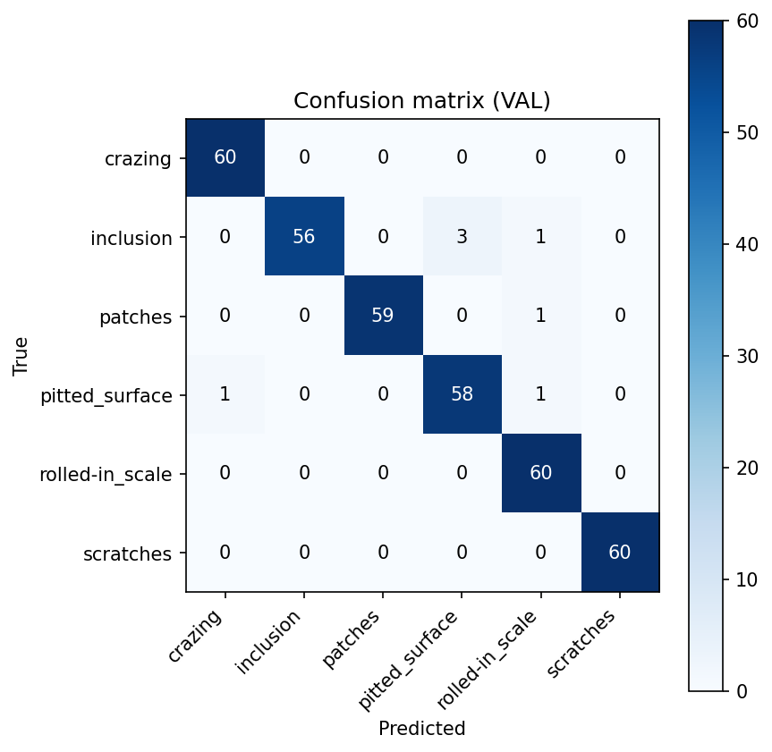
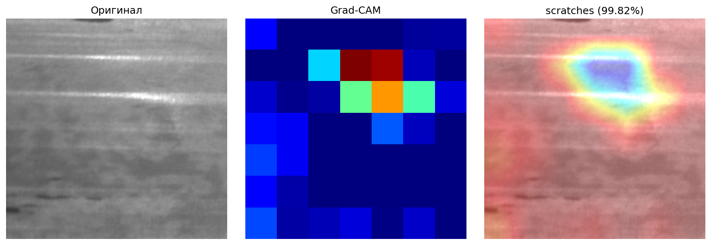

# CV Defect Classifier

Учебный проект: классификация дефектов поверхности металла на 6 классов по фото.
Модель — ResNet50V2 (transfer learning) на датасете NEU Surface Defects.
Веб-интерфейс и REST API сделаны на Flask.

## Стек

- Python 3.10+
- TensorFlow / Keras (ResNet50V2)
- Flask + Gunicorn
- OpenCV, NumPy, Pillow
- scikit-learn (для метрик), matplotlib (графики)

## Классы дефектов

`crazing`, `inclusion`, `patches`, `pitted_surface`, `rolled-in_scale`, `scratches`

Источник датасета: https://www.kaggle.com/datasets/kaustubhdikshit/neu-surface-defect-database

## Структура

```
app/                 — Flask приложение
  app.py             — роуты (/, /api/predict, /api/health)
  model_utils.py     — препроцессинг и предсказание
  models/            — обученная модель и class_names.txt
  templates/, static/
training/
  train_neu_model.py — обучение модели
  grad_cam_demo.py   — визуализация Grad-CAM
datasets/            — train/validation изображения
images/              — графики и примеры для README
Dockerfile, requirements.txt
```

## Установка

```bash
git clone https://github.com/TriplelllK/CV-Defect-Classifier.git
cd CV-Defect-Classifier

python -m venv .venv
.venv\Scripts\activate            # Windows
# source .venv/bin/activate       # Linux/Mac

pip install -r requirements.txt
```

## Обучение

```bash
python -m training.train_neu_model
```

Что делает скрипт:
- читает картинки из `datasets/train/images` и `datasets/validation/images`
- применяет аугментацию (flip, rotation, zoom, translation)
- учит «голову» поверх замороженного ResNet50V2
- сохраняет модель в `app/models/neu_best_finetuned.keras`
- кладёт графики и classification_report в `training/results/`

Занимает ~15–20 минут на CPU.

## Запуск приложения

```bash
python -m app.app
```

Открыть http://localhost:5000, загрузить картинку — получить класс и вероятности.

## REST API

```bash
curl -X POST -F "file=@image.jpg" http://localhost:5000/api/predict
```

Ответ:

```json
{
  "success": true,
  "prediction": {
    "class": "scratches",
    "confidence": 0.97,
    "probabilities": {
      "crazing": 0.001,
      "inclusion": 0.005,
      "patches": 0.01,
      "pitted_surface": 0.004,
      "rolled-in_scale": 0.01,
      "scratches": 0.97
    }
  }
}
```

Health-check:

```bash
curl http://localhost:5000/api/health
# {"status":"ok","model_loaded":true}
```

## Docker

```bash
docker build -t cv-defect-classifier .
docker run -p 5000:5000 cv-defect-classifier
```

## Модель

ResNet50V2 (imagenet weights) — backbone заморожен. Сверху:
GlobalAveragePooling → Dense(512, relu) + BN + Dropout(0.5) → Dense(256, relu) + BN + Dropout(0.5) → Dense(6, softmax).

Препроцессинг — `tf.keras.applications.resnet_v2.preprocess_input`.
Optimizer: Adam(lr=1e-4). Loss: categorical_crossentropy.
Callbacks: ReduceLROnPlateau(val_loss), EarlyStopping(val_accuracy).

## Метрики

На валидации получается ~98% accuracy.




## Grad-CAM

```bash
python -m training.grad_cam_demo
# или
python -m training.grad_cam_demo --image datasets/validation/images/scratches/scratches_290.jpg
```

Показывает, на какие области картинки модель «смотрит» при предсказании.


